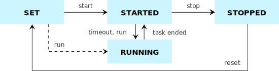

# smart 

A lightweight runtime engine for Java agents.

---

## Summary of features

- Multi-threaded runtime environment for daemon services written in Java
- Supports periodic taks on top of Java Scheduled Executor Service
- CLI-based management console with comprehensive usability features, including autocompletion
- Start, stop and reset agents independently, reducing downtime
- Customizable shell
- Standalone: runs on top of JVM, requiring no application server or additional frameworks

### Timer agents

### Daemon agents

